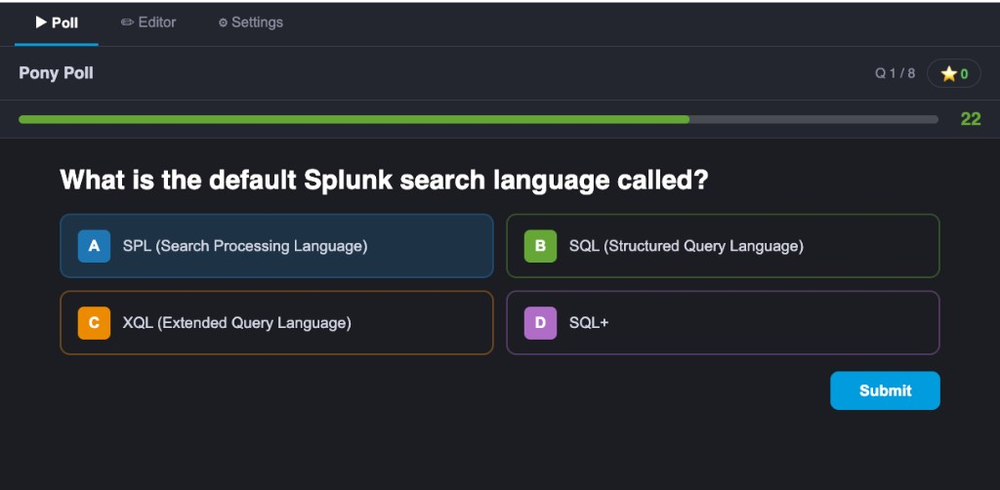

# Pony Poll — Interactive Quiz App for Splunk

**Pony Poll** is a self-contained Splunk app that turns any Splunk instance into a live quiz and polling platform. Participants answer questions in real time through a React-powered web UI embedded directly inside Splunk. All responses are stored as Splunk events, so you can build search-driven leaderboards and dashboards on top of the data immediately.


---

## Screenshots

| Poll view | Question editor |
|---|---|
|  |  |

---

## Features

| Feature | Detail |
|---|---|
| **Question types** | Single correct answer · Multiple correct answers · Yes / No · Free text · Slider / Rating |
| **Live timer** | Per-question countdown with speed-bonus scoring |
| **Nickname** | Pre-filled from the Splunk username, editable before starting |
| **WYSIWYG editor** | Built-in question editor with reorder, delete, and type switching |
| **KV Store backed** | Questions and config stored in Splunk KV Store — no database needed |
| **Splunk index** | Every answer written as a Splunk event (index configurable) |
| **Splunk brand** | Splunk dark theme, Splunk UI colours, Buttercup mascot |
| **Lazy-loaded JS** | Main bundle is ~220 KB; large dependencies loaded on demand |

---

## Architecture

```
ponypollApp/
├── Makefile                        # build / package / deploy helpers
└── src/
    ├── package.json                # JS dependencies (React 16, styled-components, webpack 5)
    ├── webpack.config.mjs          # webpack build config
    ├── babel.config.js             # Babel / JSX config
    ├── package/                    # Splunk app skeleton (copied verbatim to dist/)
    │   ├── appserver/
    │   │   ├── static/             # JS bundle, app icons, Buttercup image
    │   │   └── templates/
    │   │       └── poll.html       # Mako template — React mount point
    │   ├── bin/
    │   │   └── ponypoll_rest.py    # Python REST handler — writes answer events
    │   ├── default/
    │   │   ├── app.conf            # App identity & metadata
    │   │   ├── collections.conf    # KV Store collection definitions
    │   │   ├── indexes.conf        # Dedicated `ponypoll` index
    │   │   ├── restmap.conf        # REST endpoint registration
    │   │   ├── web.conf            # Splunk Web proxy stanzas
    │   │   └── data/ui/
    │   │       ├── nav/default.xml # Navigation bar (Poll as default view)
    │   │       └── views/poll.xml  # View definition pointing to poll.html
    │   ├── lib/splunklib/          # Vendored Splunk Python SDK
    │   └── metadata/default.meta   # KV Store access permissions
    └── web/                        # React frontend source
        ├── index.js                # Entry point (ReactDOM.render)
        ├── App.jsx                 # Top-level navigation (Poll / Editor / Settings)
        ├── components/
        │   └── Timer.jsx           # Countdown timer component
        ├── lib/
        │   ├── kvstore.js          # KV Store REST helpers + answer submission
        │   ├── questions.js        # Question model, types, serialisation, seed data
        │   └── utils.js            # uid(), formatTime(), calcPoints()
        └── pages/
            ├── PollPage.jsx        # Quiz runner — setup, questions, reveal, done
            ├── EditorPage.jsx      # Question WYSIWYG editor
            └── SettingsPage.jsx    # Poll title + Splunk index selector
```

### Data flow

```
Browser (React)
    │  GET  /en-GB/splunkd/__raw/servicesNS/nobody/ponypollapp/storage/collections/data/ponypoll_questions
    │       → load questions from KV Store
    │
    │  POST /en-GB/splunkd/__raw/services/ponypoll/v1/answer
    │       → ponypoll_rest.py → splunk.client → event written to `ponypoll` index
    │
    │  POST /en-GB/splunkd/__raw/servicesNS/nobody/ponypollapp/storage/collections/data/ponypoll_questions/batch_save
    │       → save edited questions to KV Store
    └────────────────────────────────────────────────────────────────────────────────────────────────────────
```

### KV Store collections

| Collection | Purpose |
|---|---|
| `ponypoll_questions` | Question list (text, type, options, time limit, sort order) |
| `ponypoll_config` | Poll title and target Splunk index |

### Question event fields (in Splunk)

| Field | Example |
|---|---|
| `session_id` | `a3f9bc12` |
| `nickname` | `alice` |
| `question_index` | `2` |
| `question` | `What port does Splunk Web use by default?` |
| `type` | `single` |
| `answer` | `C` |
| `correct` | `true` |
| `points` | `847` |
| `time_remaining` | `18` |

---

## Prerequisites

| Requirement | Notes |
|---|---|
| Splunk Enterprise or Cloud ≥ 8.x | KV Store must be enabled (requires valid license) |
| Python 3 | Used by the REST handler |
| Node.js ≥ 16 + Yarn | For building the frontend locally |
| `make` | For the convenience build targets |

---

## Quick start

### 1. Build

```bash
cd src
yarn install          # install JS dependencies
yarn build            # compile React → dist/appserver/static/poll.bundle.js
```

Or use the Makefile:

```bash
make deps   # yarn install
make build  # webpack production build
```

### 2. Package

```bash
make package
# → ponypollapp.tar.gz
```

The Makefile copies everything from `src/package/` and `dist/` into a clean staging directory, excludes `__pycache__`, `.pyc`, `.DS_Store`, and `local/`, then tars it.

### 3. Install

**Option A — Splunk UI:**  
Upload `ponypollapp.tar.gz` via *Apps → Manage Apps → Install app from file*.

**Option B — SCP + copy:**

```bash
scp ponypollapp.tar.gz user@splunk-host:~
ssh user@splunk-host
sudo tar -xzf ~/ponypollapp.tar.gz -C /opt/splunk/etc/apps/
sudo /opt/splunk/bin/splunk restart   # or reload via Splunk Web
```

**Option C — direct file copy (development):**

```bash
# Symlink or copy dist to the Splunk apps directory
sudo ln -sf /opt/code/ponypollApp/dist /opt/splunk/etc/apps/ponypollapp

# After each build, bump the Splunk Web cache:
# Open in browser → https://<host>:<port>/en-GB/_bump
```

### 4. Post-install

After installing, Splunk needs its UI cache refreshed:

1. Open `https://<your-splunk>:<port>/en-GB/_bump` in a browser while logged in
2. Navigate to **Apps → Pony Poll**

The app creates its KV Store collections and index automatically on first use. If the KV Store is not available, check that a valid Splunk Enterprise license is applied.

---

## Development

Start webpack in watch mode:

```bash
cd src
yarn dev
```

After each change, copy the bundle to Splunk and hit `_bump`:

```bash
sudo cp dist/appserver/static/poll.bundle.js /opt/splunk/etc/apps/ponypollapp/appserver/static/
# then visit /_bump in browser
```

---

## Question types reference

| Type | How it works | Scoring |
|---|---|---|
| `single` | One correct answer from up to 4 options | Speed bonus: 500–1000 pts |
| `multi` | Multiple correct answers — all must match | Speed bonus: 500–1000 pts |
| `yesno` | Yes or No | Speed bonus: 500–1000 pts |
| `freetext` | Open text (up to 100 chars), stored as-is | 100 pts for any non-empty answer |
| `slider` | Numeric range (configurable min/max/step/unit) | 50 pts for participation |

Slider questions store the raw numeric value in Splunk, making them ideal for rating scales, NPS scores, or confidence checks.

---

## Splunk search examples

**All answers for a session:**
```spl
index=ponypoll session_id="<id>" | table _time nickname question answer correct points
```

**Leaderboard:**
```spl
index=ponypoll | stats sum(points) as total_points by nickname | sort -total_points
```

**Correct answer rate by question:**
```spl
index=ponypoll type!=freetext type!=slider
| stats count as total, sum(eval(correct="true")) as correct_count by question
| eval pct_correct=round(correct_count/total*100, 1)
| sort -pct_correct
```

**Slider average by question:**
```spl
index=ponypoll type=slider | stats avg(answer) as avg_rating by question
```

**Free text responses:**
```spl
index=ponypoll type=freetext | table _time nickname question answer
```

---

## Configuration

All settings are available in the **Settings** tab inside the app:

| Setting | Default | Description |
|---|---|---|
| Poll title | `Pony Poll` | Shown on the start screen |
| Answer index | `ponypoll` | Splunk index where answer events are written |

Settings are stored in the `ponypoll_config` KV Store collection under the key `default`.

---

## Permissions

The `metadata/default.meta` file grants:

- **Read** — all roles (participants can load questions)
- **Write** — `admin` and `power` roles (only admins can edit questions / config)

---

## Tech stack

| Layer | Technology |
|---|---|
| Splunk app | Python 3, Splunk XML views, Mako templates |
| Frontend | React 16, styled-components v5 |
| Build | Webpack 5, Babel, Yarn |
| Splunk Python SDK | Vendored `splunklib` (Splunk SDK for Python) |
| Content | JSX / ES2020, no TypeScript |

---

## License

MIT — see [LICENSE](LICENSE) if present.

---

## Contributing

1. Fork the repo
2. `cd src && yarn install && yarn dev`
3. Make your changes in `src/web/`
4. `yarn build` and test against a local Splunk instance
5. Open a pull request

---

*Built with Splunk, React, and a little help from Buttercup.*
