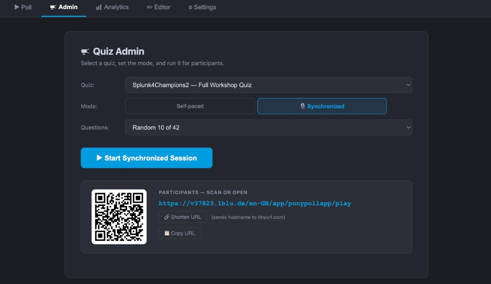
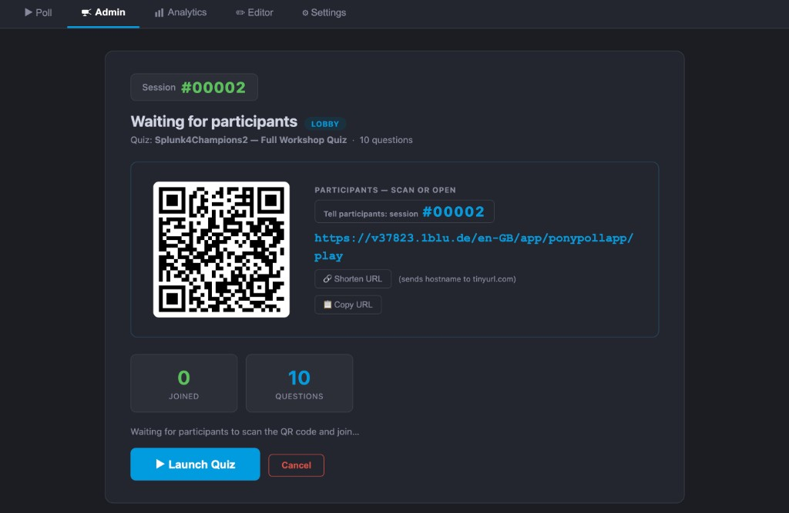
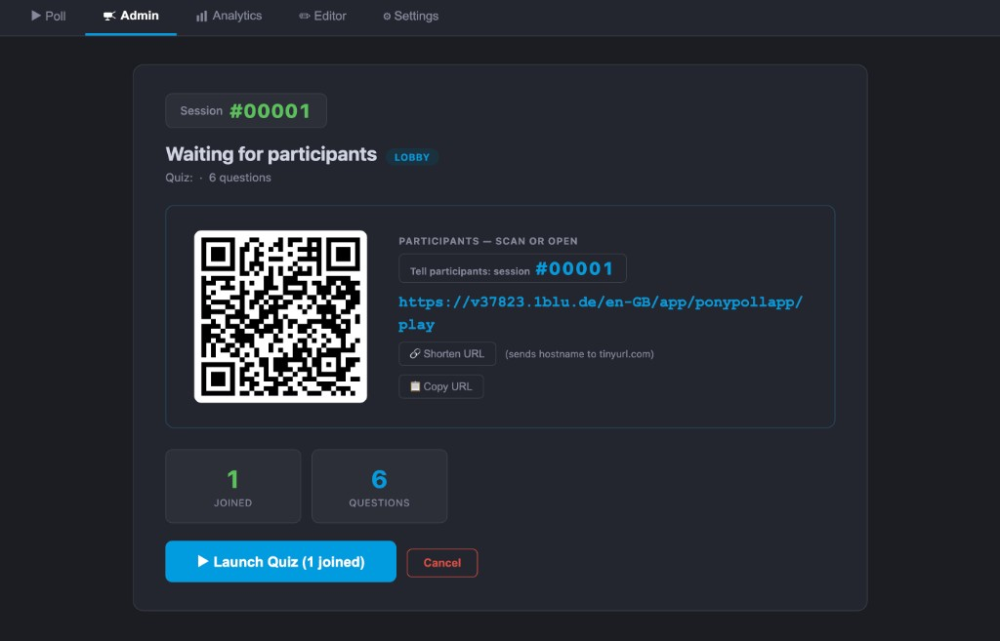
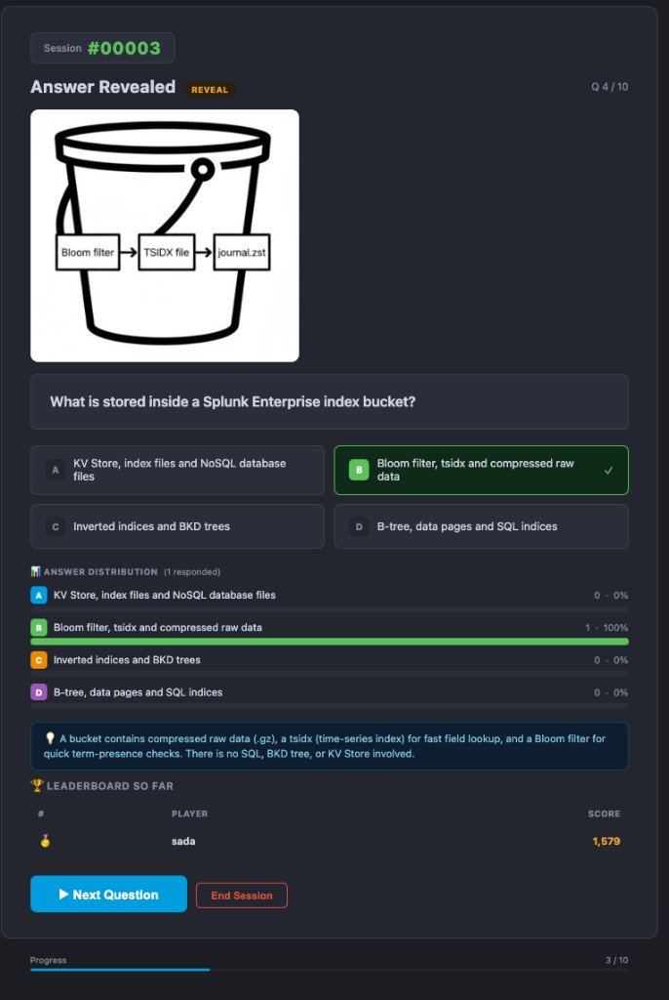
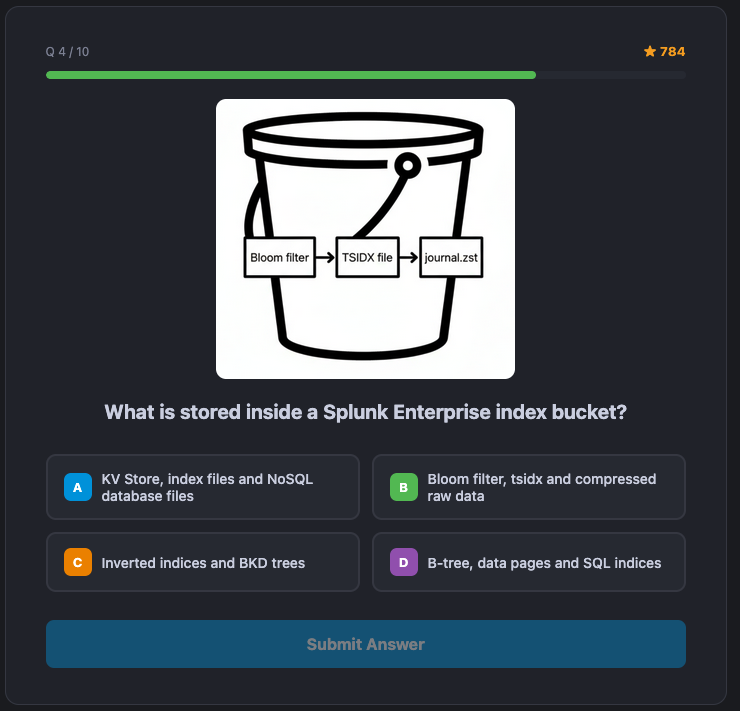
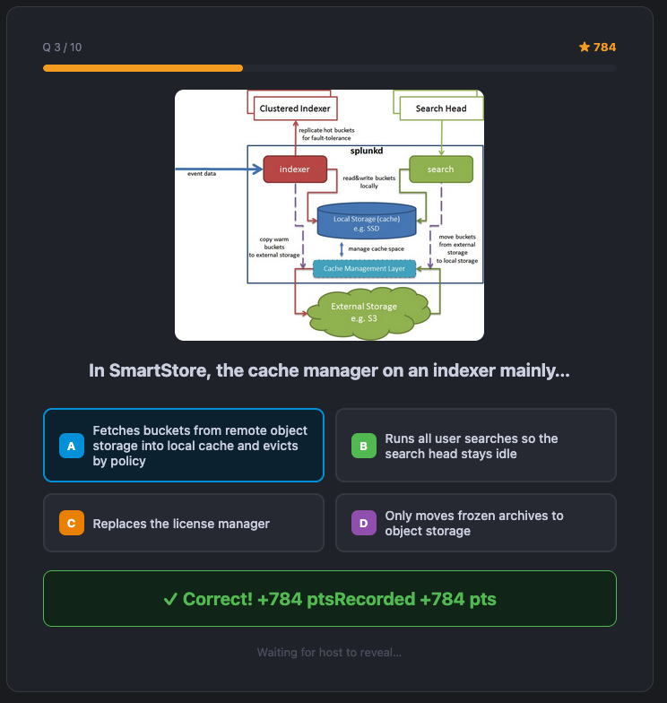
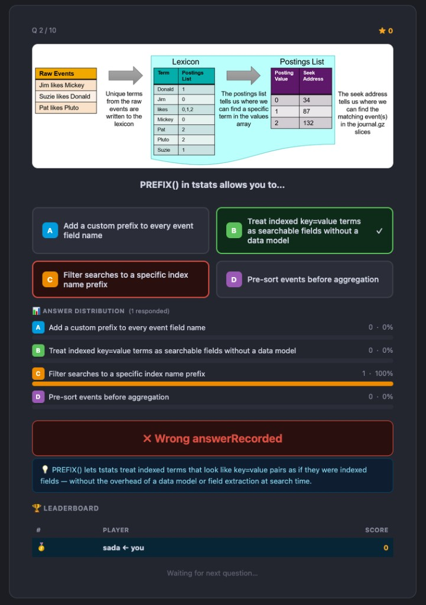
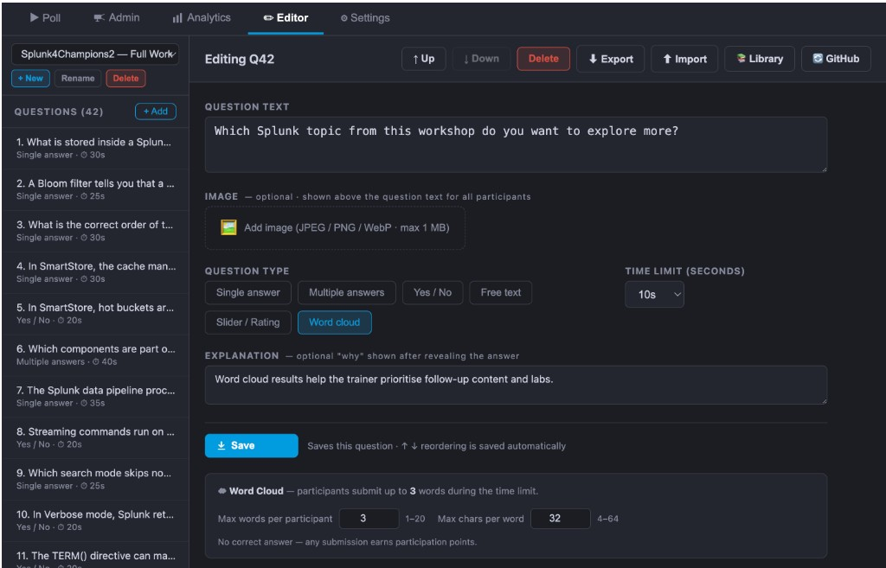
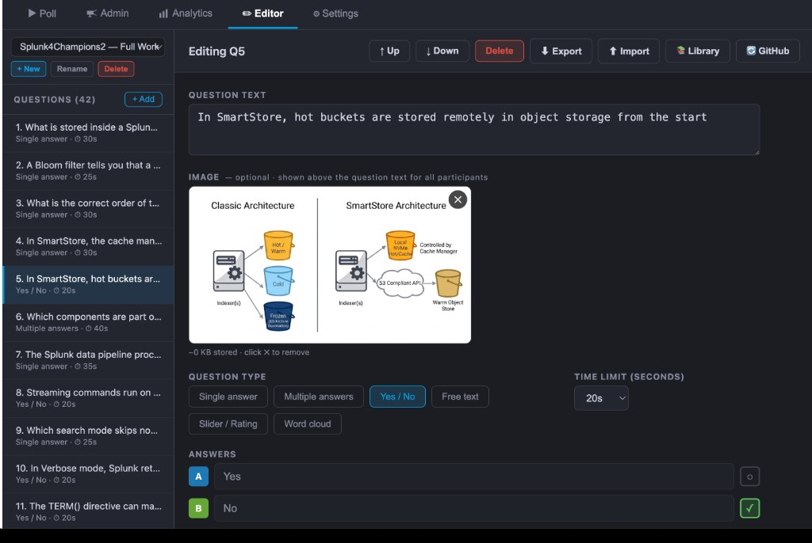

# Pony Poll — Interactive Quiz App for Splunk


> **v1.3.19** · Splunk Enterprise & Cloud ≥ 8.x · AppInspect approved ✓ · React 16 · KV Store

Pony Poll is a live interactive quiz app that runs entirely inside Splunk. Participants join through the Splunk Web UI, enter a nickname, and answer timed questions with instant scoring and feedback. The built-in editor supports six question types (single choice, multiple choice, yes/no, free text, slider, and **word cloud**), a quiz library synced from GitHub, and one-click JSON import/export. Every answer and quiz session is indexed as a native Splunk event, and the Analytics tab delivers a real-time leaderboard and per-question difficulty breakdown. Installation: download the tarball from GitHub Releases and upload it through **Apps → Manage Apps** in Splunk Web.

---

## TL;DR

**Pony Poll** turns any Splunk instance into a live interactive quiz — no extra infrastructure needed.

```
Install app → create questions in the Editor → share the **`/play`** URL with participants → watch answers flow into Splunk
```

| What | How |
|---|---|
| **Run a quiz** | Open the **Poll** tab, enter your nickname, hit Start |
| **Host a live session** | **Admin** tab — pick a quiz, set the mode, activate or start a synchronized session |
| **Build questions** | **Editor** tab — 6 types, reorder (auto-saved), set time limits, add explanations |
| **Use ready-made quizzes** | **📚 Library** (bundled) or **🔄 GitHub** (live sync from this repo) |
| **Share a quiz** | **Export** → JSON file; anyone can **Import** on another instance |
| **Analyse results** | Built-in **Analytics** tab — leaderboard, KPI cards, question difficulty, session filter; or raw SPL: `index=ponypoll \| stats sum(points) by nickname` |
| **Install** | Upload `ponypollapp.tar.gz` in Splunk UI — done |

**Requires:** Splunk Enterprise with a valid license (KV Store must be enabled).

---

## Changelog

### v1.3.19 — Synchronized mode UX improvements (2026-05-11)

- **Auto-numbered sessions**: sessions are assigned a zero-padded 5-digit number (`00001`, `00002`, …) automatically — the admin no longer needs to enter a session name
- **Session number displayed prominently**: visible on every admin panel (lobby, live question, reveal, done screen) and in the join info area with a "Tell participants: session #NNNNN" cue
- **Session number for participants**: shown large on the lobby screen before and after joining, so participants can verbally confirm the right session with the host
- **Nickname field empty by default**: the nickname input now starts empty (accent-coloured border) with a placeholder hint; pressing Enter submits when filled
- **Analytics defaults to latest session**: the session filter pre-selects the most recent session on load; sessions are listed newest-first with a `(latest)` tag
- **Splunk4Champions2 workshop quiz**: a 42-question quiz covering all workshop chapters is now available in the Library (all 6 question types, workshop images)
- **Version info in Settings**: the Settings tab now displays the Splunk version and Pony Poll app version

### v1.3.14 — Word cloud & participant permissions (2026-05-10)

**New: Word cloud question type**

A new `wordcloud` question type lets participants brainstorm and vote with words. During the countdown, each participant types up to N words; when the time is up (or they submit early) the host sees a live SVG word cloud where word size reflects how many participants mentioned that term.

- **Inline tag input**: press `Space` or `Enter` to commit each word as a chip; `Backspace` on an empty field removes the last chip
- **Phrase support**: type `word_word` or `"two words"` to submit a multi-word term as a single chip
- **Admin controls** (in the Editor): max words per participant (1–20, default 7) and max chars per word (4–64, default 32)
- **Live word cloud** on the Admin tab during both the question phase and the reveal phase
- **Auto-submit on timer expiry**: any entered words are submitted automatically when the countdown reaches zero
- **Scoring**: 100 pts for any non-empty submission; no correct/incorrect marking

**Fix: `ponypoll_user` permissions for non-admin participants**

Previously, participants assigned only the `user` Splunk role received `403 Unauthorized` errors when submitting quiz answers or joining synchronized sessions. Two capabilities are now granted to `ponypoll_user`:

| Capability | What it unlocks |
|---|---|
| `edit_tcp` | Allows `receivers/simple` POST calls from non-admin users — required to index answer events |
| `edit_kvstore` | Allows writing to `ponypoll_presence` and `ponypoll_session` — required to appear in the synchronized session lobby |

---

## Screenshots

### Admin — quiz control room



### Admin — lobby (waiting for participants)

Session number is displayed prominently. The host can announce it to the room so participants can verify they are on the right session.

| Waiting for participants | First participant joined |
|---|---|
|  |  |

### Admin — answer reveal with leaderboard



### Participant — live question



### Participant — feedback after answering

| Correct answer | Wrong answer + explanation |
|---|---|
|  |  |

### Editor

| Single-answer with image | Word cloud question |
|---|---|
|  |  |

### Analytics


---

## Admin Tab

The **Admin** tab is the quiz control room. It handles both modes from one place.

### Self-paced mode

```
Admin tab → pick a quiz → Mode: Self-paced → ▶ Activate for Self-paced
  → participants on /play load that quiz and run at their own pace
  → share the QR code / URL so participants can join
```

### Synchronized mode

In synchronized mode the presenter controls the pace for everyone simultaneously.

```
Admin tab → pick a quiz → Mode: 🎙 Synchronized
  → set question count (all or a random subset)
  → ▶ Start Synchronized Session

A session number is automatically assigned (00001, 00002, …).
It is shown prominently to the host and announced to participants.

Participants open /play in their browser or scan the QR code
  → they see the session number on screen and enter their nickname
  → they appear in the lobby (joined count increments live)

Host clicks ▶ Launch Quiz (N joined)
  → Q1 appears on every participant screen at exactly the same second
  → timer counts down from a server-authoritative timestamp (no clock drift)
  → host clicks ⏹ Reveal Answers when ready
  → answer distribution bars + explanation + interim leaderboard shown to everyone
  → host clicks ▶ Next Question … repeat until done
  → final leaderboard shown to host and participants
  → ▶ Start New Session returns to the control room
```

### Key features

| Feature | Detail |
|---|---|
| **Unified control room** | One tab for both self-paced activation and synchronized session management |
| **Auto-numbered sessions** | Sessions are named `00001`, `00002`, … automatically — no manual entry needed; number appears on every admin panel and on the participant join screen |
| **Session visibility for participants** | The session number is displayed large on the participant lobby before and after joining — makes it easy to confirm the right session verbally |
| **"Tell participants" cue** | JoinInfo panel shows `Tell participants: session #00002` next to the QR code so the host knows what to announce |
| **QR code** | Shown in the Admin tab; white-on-black, always scannable on a projector |
| **Short URL** | TinyURL auto-generated client-side for easy typing on laptops |
| **Server-authoritative timer** | All clients compute remaining time from `question_started_at` in KV Store — no clock drift |
| **Answer distribution** | Horizontal bars per option shown after reveal (both host and participant screens) |
| **Answer explanation** | Optional "why" text written in the Editor; shown as a 💡 callout after reveal on all screens |
| **Leaderboard after each question** | Runs a live SPL query against the Splunk index per reveal |
| **Random question subset** | Choose how many questions to play at session-start (overrides the quiz default) |
| **Auto-switch on /play** | The `/play` URL detects a live sync session every 1.5 s — participants are automatically routed without a reload |
| **Full rollback** | Self-paced `PollPage` is completely untouched; switching back to self-paced is instant |

### Mode toggle

In the **Admin** tab, each quiz has a **Mode** toggle that is saved immediately to KV Store:

- **Self-paced** — each participant runs the quiz independently (default)
- **🎙 Synchronized** — host controls the pace; a session number is assigned automatically on start

---

## Features

| Feature | Detail |
|---|---|
| **Question types** | Single correct answer · Multiple correct answers · Yes / No · Free text · Slider / Rating · **Word cloud** |
| **Multiple quizzes** | Create, rename, and delete any number of named quizzes; one quiz is set as *live* for participants at a time |
| **Admin tab** | Unified quiz control room — activate self-paced quizzes or start synchronized sessions; includes QR code, short URL, and auto-numbered session badge |
| **Synchronized host mode** | Presenter-led quiz: sessions are auto-numbered (`00001`, `00002`, …); host controls question flow, all participants see the same question simultaneously with server-authoritative timer, answer distribution, explanation callout, and per-question leaderboard |
| **Answer explanation** | Optional "why" text per question shown as a 💡 callout after revealing the correct answer (self-paced and synchronized) |
| **Random question subset** | Set a quiz to play a random N questions from its full pool (e.g. 12 of 34) — each participant gets a different draw |
| **Export / Import** | Download any quiz as a JSON file; import to replace or append questions — great for sharing question sets between Splunk instances |
| **Quiz library** | Bundled pre-built quizzes (Splunk4Champions, Splunk Basics) importable with one click via **📚 Library**; **🔄 GitHub** button syncs the latest quizzes live from the repo |
| **Live timer** | Per-question countdown with speed-bonus scoring |
| **Nickname** | Empty by default with a contextual hint; required before starting or joining — a clear visual cue highlights the field until filled |
| **WYSIWYG editor** | Built-in question editor with reorder, delete, and type switching |
| **KV Store backed** | Questions, quizzes, and config stored in Splunk KV Store — no external database needed |
| **Analytics dashboard** | Built-in **📊 Analytics** tab — KPI scorecards, leaderboard, per-question difficulty bars, recent sessions; filterable by time range, quiz, session name, and nickname |
| **Word cloud** | New question type — participants submit up to N words during the time limit; the host sees a live SVG word cloud where size = frequency |
| **Participant permissions** | `ponypoll_user` role ships with `edit_tcp` and `edit_kvstore` capabilities so non-admin users can submit answers and appear in the synchronized lobby |
| **Splunk index** | Every answer and quiz lifecycle event written directly via `receivers/simple` — no custom Python required |
| **Splunk brand** | Splunk dark theme, Splunk UI colours, Buttercup mascot |
| **Lazy-loaded JS** | Main bundle is ~220 KB; large dependencies loaded on demand |

---

## Architecture

```
ponypollApp/
├── Makefile                        # build / package / deploy helpers
└── src/
    ├── package.json                # JS dependencies (React 16, styled-components, webpack 5)
    ├── webpack.config.mjs          # webpack build config
    ├── babel.config.js             # Babel / JSX config
    ├── package/                    # Splunk app skeleton (copied verbatim to dist/)
    │   ├── appserver/
    │   │   ├── static/             # JS bundle, app icons, Buttercup image
    │   │   └── templates/
    │   │       └── poll.html       # Mako template — React mount point
    │   ├── default/
    │   │   ├── app.conf            # App identity & metadata
    │   │   ├── collections.conf    # KV Store collection definitions
    │   │   ├── indexes.conf        # Dedicated `ponypoll` index
    │   │   ├── web.conf            # Splunk Web proxy stanzas (KV Store, receivers/simple, search/jobs)
    │   │   └── data/ui/
    │   │       ├── nav/default.xml # Navigation bar (Poll as default view)
    │   │       ├── views/poll.xml  # Full app view (host/presenter)
    │   │       └── views/play.xml  # Participant-only view (quiz only)
    │   ├── lib/splunklib/          # Vendored Splunk Python SDK
    │   └── metadata/default.meta   # KV Store access permissions
    └── web/                        # React frontend source
        ├── index.js                # Entry point (ReactDOM.render)
        ├── App.jsx                 # Top-level navigation (Poll / Analytics / Editor / Settings)
        ├── components/
        │   └── Timer.jsx           # Countdown timer component
        ├── lib/
        │   ├── kvstore.js          # KV Store REST helpers, answer submission, runSearch()
        │   ├── questions.js        # Question model, types, serialisation, seed data
        │   └── utils.js            # uid(), formatTime(), calcPoints()
        └── pages/
            ├── PollPage.jsx        # Quiz runner — setup, questions, reveal, done
            ├── AnalyticsPage.jsx   # Analytics dashboard — KPI cards, leaderboard, question analysis
            ├── EditorPage.jsx      # Question WYSIWYG editor + quiz management
            └── SettingsPage.jsx    # Poll title, Splunk index, active quiz selector
```

### How the Splunk chrome is removed

> **Why there are no Splunk menus, navigation bar, or app switcher visible.**

Both views (`poll.xml` and `play.xml`) are declared with `type="html"` and point to a hand-rolled Mako template (`poll.html`) that loads **only** the React bundle — nothing from Splunk's front-end stack:

```xml
<!-- views/play.xml -->
<view type="html" isDashboard="False" isVisible="False" onunloadCancelJobs="False">
```

| Attribute | Effect |
|---|---|
| `type="html"` | Splunk renders raw HTML instead of a SimpleXML dashboard — no dashboard chrome injected |
| `isDashboard="False"` | Suppresses the standard dashboard toolbar |
| `isVisible="False"` | Hides the view from the Splunk navigation bar |

A standard Splunk view imports the full JS stack via a Mako namespace:
```html
<%namespace name="lib" file="//lib/splunkjsstack.html"/>
```
This single line is what causes the top navigation bar, app switcher, and footer to appear. The `poll.html` template deliberately omits it and instead mounts React onto a plain `<div id="root">`.

The tabs you see inside the app (Poll · Editor · Analytics · Settings) are **React components**, not Splunk's native tab bar. The app still has full access to the KV Store and REST APIs because Splunk's session cookie is present — it just has none of the surrounding UI.

---

### Data flow

```
Browser (React)
    │  GET  /splunkd/__raw/servicesNS/nobody/ponypollapp/storage/collections/data/ponypoll_quizzes
    │       → load quiz catalogue
    │
    │  GET  /splunkd/__raw/servicesNS/nobody/ponypollapp/storage/collections/data/ponypoll_config
    │       → load config (active quiz ID, poll title)
    │
    │  GET  /splunkd/__raw/servicesNS/nobody/ponypollapp/storage/collections/data/ponypoll_questions?query=...
    │       → load questions for the active quiz
    │
    │  POST /splunkd/__raw/services/receivers/simple?index=ponypoll&sourcetype=ponypoll_answer
    │       → event written directly to Splunk index (no custom Python)
    │
    │  POST /splunkd/__raw/services/receivers/simple?index=ponypoll&sourcetype=ponypoll_attempt
    │       → quiz_start / quiz_complete lifecycle events
    │
    │  POST /splunkd/__raw/services/search/jobs  (exec_mode=oneshot)
    │       → Analytics tab runs SPL against ponypoll index, renders results in React
    │
    │  POST /splunkd/__raw/servicesNS/nobody/ponypollapp/storage/collections/data/ponypoll_questions/batch_save
    │       → save edited questions to KV Store
    └──────────────────────────────────────────────────────────────────────────────────────
```

### KV Store collections

| Collection | Purpose |
|---|---|
| `ponypoll_questions` | Question list (text, type, options, time limit, sort order, quiz_id) |
| `ponypoll_quizzes` | Named quiz catalogue (name, created_at, question_limit) |
| `ponypoll_config` | Poll title, target Splunk index, and active quiz ID |

### Question event fields (in Splunk)

| Field | Example |
|---|---|
| `session_id` | `a3f9bc12` |
| `nickname` | `alice` |
| `question_index` | `2` |
| `question` | `What port does Splunk Web use by default?` |
| `type` | `single` |
| `answer` | `C` |
| `correct` | `true` |
| `points` | `847` |
| `time_remaining` | `18` |

---

## Installation

### Step 1 — Download the latest release

Go to the [**Releases page**](https://github.com/bautt/ponypollApp/releases/latest) and download **`ponypollapp.tar.gz`** from the Assets section.

### Step 2 — Install via the Splunk UI

1. Log in to Splunk Web as an administrator.
2. Click the **⚙ gear icon** (top-left) next to "Apps", or navigate to  
   **Apps → Manage Apps**.
3. Click **Install app from file** (top-right button).
4. Click **Choose File**, select the downloaded `ponypollapp.tar.gz`, then click **Upload**.
5. If prompted to restart Splunk, click **Restart Now** and wait for Splunk to come back up.
6. After restart, **Pony Poll** appears in the app bar. Click it to open.

> **Splunk Cloud:** Use the Splunk Cloud self-service app install in the Admin Console, or contact your Splunk admin to install via the REST API.

### Step 3 — First run

1. Open the app — you land on the **Poll** tab.
2. Switch to the **Editor** tab and create your first question, or click **📚 Library** to import a ready-made quiz.
3. Go to **Settings** and set the **Active quiz** (the quiz participants will see).
4. Share the **Play URL** with participants (see below) — they enter a nickname and click **Start**.

### Two entry points

The app exposes two URLs with different audiences:

| URL | Who it's for | What they see |
|-----|-------------|---------------|
| `/app/ponypollapp/poll` | **Host / presenter** | Full app — Poll, Editor, Analytics, Settings tabs |
| `/app/ponypollapp/play` | **Participants** | Quiz only — nickname input, questions, score reveal |

Share the `/play` URL with your audience. It shows only the quiz so participants can't accidentally wander into the editor or analytics.

Both URLs are listed in the app's navigation bar inside Splunk.

#### Making `/play` the default

In **Settings → Default view** you can switch the default entry point to **Play**. When set, anyone opening the app URL is automatically redirected to `/play`.

**Getting back to the full admin app when Play is default:**

| Method | How |
|---|---|
| **⚙ Admin link** | Hover the bottom-right corner of the `/play` view — a subtle link appears |
| **URL bypass** | Navigate to `/app/ponypollapp/poll?admin` — the `?admin` param skips the redirect permanently for that session |

Bookmark `/app/ponypollapp/poll?admin` as your admin shortcut when running workshops in Play-default mode.

### Requirements

| Requirement | Notes |
|---|---|
| Splunk Enterprise ≥ 8.x | KV Store must be enabled — requires a valid (non-free) license |
| Splunk Cloud ✓ | Tested and working on Splunk Cloud — AppInspect approved |
| Browser | Any modern browser (Chrome, Firefox, Edge, Safari) |

> **No Node.js, Python, or build tools are needed** to run the app — the pre-built JavaScript bundle is included in the release tarball.

---

## Building from source

Only needed if you want to modify the frontend code.

### Prerequisites

| Requirement | Notes |
|---|---|
| Node.js ≥ 16 + Yarn | For building the frontend |
| `make` | For the convenience build targets |

### Build & package

```bash
cd src
yarn install   # install JS dependencies
```

```bash
make build     # webpack production build → dist/
make package   # bundle into ponypollapp.tar.gz
```

Install the resulting `ponypollapp.tar.gz` via the Splunk UI as described above.

**Option C — direct file copy (development):**

```bash
# Symlink or copy dist to the Splunk apps directory
sudo ln -sf /opt/code/ponypollApp/dist /opt/splunk/etc/apps/ponypollapp

# After each build, bump the Splunk Web cache:
# Open in browser → https://<host>:<port>/en-GB/_bump
```

### 4. Post-install

After installing:

1. Restart Splunk (required for KV Store collections to be created from `collections.conf`)
2. Open `https://<your-splunk>:<port>/en-GB/_bump` in a browser while logged in
3. Navigate to **Apps → Pony Poll**

On first load, the app auto-creates a **"Default Quiz"** in the KV Store and seeds it with example questions. From the **Editor** tab you can then create additional quizzes, manage questions, and export/import question sets.

---

## Development

Start webpack in watch mode:

```bash
cd src
yarn dev
```

After each change, copy the bundle to Splunk and hit `_bump`:

```bash
sudo cp dist/appserver/static/poll.bundle.js /opt/splunk/etc/apps/ponypollapp/appserver/static/
# then visit /_bump in browser
```

---

## Question types reference

| Type | How it works | Scoring |
|---|---|---|
| `single` | One correct answer from up to 4 options | Speed bonus: 500–1000 pts |
| `multi` | Multiple correct answers — all must match | Speed bonus: 500–1000 pts |
| `yesno` | Yes or No | Speed bonus: 500–1000 pts |
| `freetext` | Open text (up to 100 chars), stored as-is | 100 pts for any non-empty answer |
| `slider` | Numeric range (configurable min/max/step/unit) | 50 pts for participation |
| `wordcloud` | Participants submit up to N short words or phrases during the time limit; host sees a live SVG word cloud sized by frequency | 100 pts for any non-empty submission |

Slider questions store the raw numeric value in Splunk, making them ideal for rating scales, NPS scores, or confidence checks.

---

## Word cloud question

The **word cloud** type is designed for open-ended questions where you want to see which terms participants mention most — brainstorming, mood checks, "one word to describe X", or collective tagging exercises.

### How participants enter words

Words are entered in an inline tag field:

- Press **Space** or **Enter** to commit each word as a chip
- Press **Backspace** on an empty field to remove the last chip
- To submit a **multi-word phrase** as a single term, use either:
  - Underscores: `machine_learning` → displayed as *machine learning*
  - Quotes: `"machine learning"` → displayed as *machine learning*

### Admin configuration (in the Editor)

| Setting | Default | Range | Description |
|---|---|---|---|
| **Time limit** | 30 s | any | Countdown in seconds — same as all other question types |
| **Max words per participant** | 7 | 1–20 | Maximum number of word chips a participant can submit |
| **Max chars per word** | 32 | 4–64 | Maximum character length of each individual word chip |

When the timer expires, any words already entered are submitted automatically.

### What the host sees

During the question **and** on reveal, the Admin tab shows a live SVG word cloud:

- Word **size** is proportional to submission frequency
- Words are placed using a greedy non-overlapping layout
- Up to 10% of words are rotated ±45° for visual variety
- Colors cycle through the Splunk palette

The SPL behind the live cloud (runs every 3 s during the question phase):

```spl
index=ponypoll sourcetype=ponypoll_answer session_id="<sid>" question_index=<n>
| eval words=split(answer,",")
| mvexpand words
| eval word=trim(words)
| where len(word)>0
| stats count by word
| sort -count
| rename word as answer
```

### JSON format for word cloud questions

```json
{
  "text": "Name one thing Splunk does better than anything else",
  "type": "wordcloud",
  "timeLimit": 30,
  "wordcloudMaxWords": 7,
  "wordcloudMaxChars": 32
}
```

| Field | Type | Default | Description |
|---|---|---|---|
| `wordcloudMaxWords` | number | `7` | Maximum words per participant |
| `wordcloudMaxChars` | number | `32` | Maximum characters per word |

---

## Multiple quizzes

The **Editor** tab has a quiz selector bar at the top of the sidebar. From there you can:

- **Switch** between quizzes using the dropdown
- **+ New** — create a new named quiz
- **Rename** — rename the currently selected quiz
- **Delete** — delete the quiz and all its questions (requires at least one quiz to remain)

The **Admin** tab is where you choose which quiz to run. A `▶` marker in the quiz picker shows which quiz is currently live for participants.

The **Settings** tab also has an **Active quiz** selector as a fallback control.

---

## Random question subset

When a quiz has many questions (for example a Splunk AI quiz with 34 questions), you can configure it to play only a random selection of them per session.

### Setting a subset

In the **Admin** tab, the **Questions** dropdown sets the default subset for the selected quiz:

| Selection | Behaviour |
|---|---|
| **All (N)** | Every question plays (default) |
| **Random N of M** | N questions are drawn at random from the full pool each time the quiz starts |

For **synchronized sessions**, the host can also override this per-session from the Admin tab's Questions picker before clicking Start — it doesn't change the quiz's saved default.

The setting is saved immediately and persists across sessions. Participants who run the same quiz at the same time will each receive a different random draw.

### Why use this?

- **Large question banks** — build a pool of 30–40 questions and serve a shorter, varied quiz (e.g. 10 questions) so repeat participants see different content each time
- **Timed workshops** — limit the quiz to fit a time slot without removing questions from the bank
- **Assessment fairness** — each participant gets a unique set, reducing copying

### How it works

When the quiz starts, questions are shuffled using the Fisher-Yates algorithm and the first N are selected. The order within that subset is also randomised, so two participants who happen to draw some of the same questions will still see them in a different order.

> **Tip:** The Analytics tab and Splunk SPL queries still work normally — each logged event includes the full question text, so you can see which questions were answered even when different participants received different subsets.

---

## Quiz library & GitHub sync

The app ships with a set of pre-built quiz JSON files and can also pull the latest quizzes directly from the GitHub repository.

### Using the library

In the **Editor** tab the toolbar has two buttons:

| Button | Source | Internet required |
|---|---|---|
| **📚 Library** | Files bundled with the app (`appserver/static/quizzes/`) — always available offline | No |
| **🔄 GitHub** | Live manifest and quiz files fetched from `github.com/bautt/ponypollApp` | Yes |

Both open the same **Library modal** with a source toggle at the top so you can switch between bundled and live without closing. The GitHub tab shows the repo URL, a **↺ Refresh** button to force a re-fetch, and clear error feedback when internet access is unavailable.

After choosing a quiz, clicking **Import** shows the same Replace / Append confirmation as a file import.

### Bundled quizzes

| File | Name | Questions | Difficulty | Topics |
|---|---|---|---|---|
| [`splunk4champions2-workshop.json`](quizzes/splunk4champions2-workshop.json) | Splunk4Champions2 — Full Workshop Quiz | 42 | Intermediate–Advanced | SmartStore, buckets, tstats, search modes, pipeline, lookups, CIM, Dashboard Studio, SPL optimisation — all 6 question types |
| [`splunk4champions.json`](quizzes/splunk4champions.json) | Splunk4Champions — Advanced Topics | 22 | Advanced | tstats, buckets, bloom filters, Dashboard Studio, SmartStore, search performance, metrics |
| [`splunk-basics.json`](quizzes/splunk-basics.json) | Splunk Basics | 15 | Beginner | Components, ports, SPL commands, data lifecycle, HEC, forwarders, KV Store |

The source JSON files live in the [`quizzes/`](quizzes/) folder of the repository. See [`quizzes/README.md`](quizzes/README.md) for the full format reference and instructions for contributing new quizzes.

### Adding quizzes to the library

1. Create a new JSON file in `quizzes/` following the [JSON schema](#importexport-json-format)
2. Add an entry to `quizzes/manifest.json`
3. Copy the file to `src/package/appserver/static/quizzes/`
4. Rebuild the app (`make build`) — webpack copies the static files automatically
5. Commit and push — the GitHub sync button will immediately serve the new quiz to any instance with internet access, without requiring a new app deployment

---

## Editor

The **Editor** tab is for building and managing quiz content.

### Toolbar actions

| Button | Action |
|---|---|
| **↑ Up / ↓ Down** | Reorder the selected question — order is auto-saved immediately, no extra step needed |
| **Delete** | Delete the selected question (with confirmation) |
| **⬇ Export** | Download the current quiz as a JSON file |
| **⬆ Import** | Load questions from a JSON file (choose Replace or Append) |
| **📚 Library** | Import a bundled pre-built quiz |
| **🔄 GitHub** | Sync and import quizzes from the GitHub repository |

### Question fields

| Field | Notes |
|---|---|
| **Question text** | The question shown to participants |
| **Type** | Single · Multi · Yes/No · Free text · Slider · Word cloud |
| **Time limit** | Countdown in seconds |
| **Answers** | Options with ✓ correct marking (not for slider/freetext) |
| **Explanation** | Optional "why" text shown as a 💡 callout after the answer is revealed |

### Saving

Click the **Save** button at the bottom of the editor panel to save the current question. Reordering with ↑/↓ is auto-saved instantly. There is no "Save All" — each question is an independent KV Store document.

---

## Export & Import

### Exporting a quiz

In the **Editor** tab, click **⬇ Export** in the toolbar. The browser downloads a `.json` file named after the quiz (e.g. `My Quiz.json`). The file contains an array of question objects.

### Importing questions

Click **⬆ Import** and select a `.json` file. A confirmation banner appears offering two options:

- **Replace** — deletes all current questions in the active quiz and replaces them with the imported set
- **Append** — adds the imported questions after the existing ones

This makes it easy to share question sets between Splunk instances or to maintain a library of question banks.

---

## Import/Export JSON format

The exported JSON is an array of question objects. Below is the full schema with one example per question type.

### JSON schema overview

```json
[
  {
    "text": "Question text shown to participants",
    "type": "single | multi | yesno | freetext | slider | wordcloud",
    "timeLimit": 30,
    "explanation": "Optional one-line 'why' shown after the answer is revealed",
    "options": [ ... ],
    "sliderMin": 1,
    "sliderMax": 10,
    "sliderStep": 1,
    "sliderUnit": "",
    "wordcloudMaxWords": 7,
    "wordcloudMaxChars": 32
  }
]
```

| Field | Type | Required | Description |
|---|---|---|---|
| `text` | string | **yes** | The question text displayed to participants |
| `type` | string | **yes** | One of `single`, `multi`, `yesno`, `freetext`, `slider`, `wordcloud` |
| `timeLimit` | number | no | Countdown in seconds (default: `30`) |
| `explanation` | string | no | Short "why" text shown as a 💡 callout after the correct answer is revealed (default: `""`) |
| `options` | array | for `single`/`multi`/`yesno` | Answer choices — see per-type details below |
| `sliderMin` | number | for `slider` | Minimum slider value (default: `1`) |
| `sliderMax` | number | for `slider` | Maximum slider value (default: `10`) |
| `sliderStep` | number | for `slider` | Step increment (default: `1`) |
| `sliderUnit` | string | for `slider` | Unit label shown next to the value, e.g. `"/10"`, `"°C"` (default: `""`) |
| `wordcloudMaxWords` | number | for `wordcloud` | Max number of words per participant (default: `7`, range: 1–20) |
| `wordcloudMaxChars` | number | for `wordcloud` | Max characters per word chip (default: `32`, range: 4–64) |

> **Note:** The `_key` and `quiz_id` fields are stripped on export and regenerated on import, so JSON files are fully portable between instances.

---

### Type: `single` — one correct answer

```json
{
  "text": "What port does Splunk Web use by default?",
  "type": "single",
  "timeLimit": 25,
  "options": [
    { "id": "A", "text": "80",   "correct": false },
    { "id": "B", "text": "443",  "correct": false },
    { "id": "C", "text": "8000", "correct": true  },
    { "id": "D", "text": "8089", "correct": false }
  ]
}
```

- `options` is an array of 2–4 choices
- Exactly **one** option should have `"correct": true`
- `id` values must be unique within the question; use `"A"`, `"B"`, `"C"`, `"D"`

---

### Type: `multi` — multiple correct answers

```json
{
  "text": "Which of the following are Splunk search commands? (Select all that apply)",
  "type": "multi",
  "timeLimit": 40,
  "options": [
    { "id": "A", "text": "stats",     "correct": true  },
    { "id": "B", "text": "timechart", "correct": true  },
    { "id": "C", "text": "WHERE",     "correct": false },
    { "id": "D", "text": "table",     "correct": true  }
  ]
}
```

- Two or more options can have `"correct": true`
- Participants must select **all** correct options — partial selections score zero

---

### Type: `yesno` — yes or no

```json
{
  "text": "Was the installation straightforward?",
  "type": "yesno",
  "timeLimit": 20,
  "options": [
    { "id": "A", "text": "Yes", "correct": true  },
    { "id": "B", "text": "No",  "correct": false }
  ]
}
```

- Always exactly two options with `id` `"A"` and `"B"`
- The editor auto-generates these; you may omit `options` when importing and the defaults will apply
- Set `"correct": true` on the answer you want to count as correct, or make both `false` for a no-scoring poll question

---

### Type: `freetext` — open text entry

```json
{
  "text": "What is your favourite Splunk feature?",
  "type": "freetext",
  "timeLimit": 60,
  "options": []
}
```

- `options` must be an empty array (or omitted)
- No correct/incorrect scoring; participants receive **100 pts** for any non-empty answer
- The raw text is stored in the `answer` field of the Splunk event

---

### Type: `slider` — numeric rating

```json
{
  "text": "Rate your overall confidence with Splunk (1 = beginner, 10 = expert)",
  "type": "slider",
  "timeLimit": 30,
  "options": [],
  "sliderMin": 1,
  "sliderMax": 10,
  "sliderStep": 1,
  "sliderUnit": "/10"
}
```

- `options` must be an empty array (or omitted)
- Participants drag a slider; the selected numeric value is stored in `answer`
- All participants receive **50 pts** for participation (no correct answer)
- Common uses: NPS score (`0`–`10`), confidence rating, Likert scale (`1`–`5`)

**NPS example:**

```json
{
  "text": "How likely are you to recommend this workshop to a colleague? (0 = not at all, 10 = definitely)",
  "type": "slider",
  "timeLimit": 30,
  "options": [],
  "sliderMin": 0,
  "sliderMax": 10,
  "sliderStep": 1,
  "sliderUnit": ""
}
```

---

### Type: `wordcloud` — open word submission

```json
{
  "text": "Name one thing Splunk does better than anything else",
  "type": "wordcloud",
  "timeLimit": 30,
  "wordcloudMaxWords": 7,
  "wordcloudMaxChars": 32
}
```

- `options` should be an empty array (or omitted)
- No correct/incorrect scoring; participants receive **100 pts** for any non-empty submission
- Participants enter up to `wordcloudMaxWords` chips; each chip is limited to `wordcloudMaxChars` characters
- Multi-word phrases: type `word_word` or `"two words"` — both are stored and displayed with spaces
- Submitted words are stored as a comma-separated string in the `answer` field of the Splunk event
- The host sees a live SVG word cloud on both the question phase and the reveal phase — word size reflects submission frequency

---

### Complete example file

```json
[
  {
    "text": "What is the default Splunk search language called?",
    "type": "single",
    "timeLimit": 30,
    "explanation": "SPL (Search Processing Language) is Splunk's native query language, used in every search bar.",
    "options": [
      { "id": "A", "text": "SPL (Search Processing Language)", "correct": true  },
      { "id": "B", "text": "SQL (Structured Query Language)",  "correct": false },
      { "id": "C", "text": "XQL (Extended Query Language)",    "correct": false },
      { "id": "D", "text": "SQL+",                            "correct": false }
    ]
  },
  {
    "text": "Which of the following are Splunk search commands? (Select all that apply)",
    "type": "multi",
    "timeLimit": 40,
    "options": [
      { "id": "A", "text": "stats",     "correct": true  },
      { "id": "B", "text": "timechart", "correct": true  },
      { "id": "C", "text": "WHERE",     "correct": false },
      { "id": "D", "text": "table",     "correct": true  }
    ]
  },
  {
    "text": "Was the installation straightforward?",
    "type": "yesno",
    "timeLimit": 20,
    "options": [
      { "id": "A", "text": "Yes", "correct": true  },
      { "id": "B", "text": "No",  "correct": false }
    ]
  },
  {
    "text": "What is your favourite Splunk feature?",
    "type": "freetext",
    "timeLimit": 60,
    "options": []
  },
  {
    "text": "Rate your overall confidence with Splunk (1 = beginner, 10 = expert)",
    "type": "slider",
    "timeLimit": 30,
    "options": [],
    "sliderMin": 1,
    "sliderMax": 10,
    "sliderStep": 1,
    "sliderUnit": "/10"
  },
  {
    "text": "Name one thing Splunk does better than anything else",
    "type": "wordcloud",
    "timeLimit": 30,
    "wordcloudMaxWords": 7,
    "wordcloudMaxChars": 32
  }
]
```

---

## Analytics dashboard

The built-in **📊 Analytics** tab gives you a live view of quiz results without writing any SPL.


### Filters

| Filter | Options |
|---|---|
| **Time range** | Last 15 min / 1h / 4h / 24h / 7 days / 30 days / All time |
| **Quiz** | Any named quiz from the KV Store catalogue, or *All quizzes* |
| **Session** | Any synchronized session number (e.g. `00003`), or *All sessions*; defaults to the most recent session; only shown when sync session data exists in the index |
| **Nickname** | Any individual player (auto-populated from the index), or *All players* |

### Panels

| Panel | What it shows |
|---|---|
| **Quiz completions** | Count of `quiz_complete` events in the selected window |
| **Unique players** | Distinct `dc(nickname)` across completed quizzes |
| **Avg score** | Mean `total_score` across all completions |
| **Top score** | Single highest score achieved |
| **Answers submitted** | Total `ponypoll_answer` event count |
| **🏆 Leaderboard** | Top 20 players ranked by best score, with 🥇🥈🥉 medals and proportional score bars |
| **📊 Question difficulty** | Each question's % correct and avg points, colour-coded: 🟢 ≥70% / 🟡 ≥40% / 🔴 <40% |
| **🕒 Recent sessions** | Last 50 `quiz_start` / `quiz_complete` events with timestamp, player, score |

### How it works

The Analytics tab uses Splunk's `search/jobs` REST endpoint in **oneshot mode** — it posts SPL directly from the browser and renders results in React. No custom Python required.

---

## Splunk search examples

**All answers for a session:**
```spl
index=ponypoll session_id="<id>" | table _time nickname question answer correct points
```

**Leaderboard (best score per player):**
```spl
index=ponypoll sourcetype=ponypoll_attempt event=quiz_complete
| stats max(total_score) as best_score, count as runs by nickname
| sort -best_score
```

**Correct answer rate by question:**
```spl
index=ponypoll type!=freetext type!=slider
| stats count as total, sum(eval(correct="true")) as correct_count by question
| eval pct_correct=round(correct_count/total*100, 1)
| sort -pct_correct
```

**Slider average by question:**
```spl
index=ponypoll type=slider | stats avg(answer) as avg_rating by question
```

**NPS distribution:**
```spl
index=ponypoll type=slider
| eval bucket=case(answer<=6,"Detractor", answer<=8,"Passive", answer>=9,"Promoter")
| stats count by bucket
```

**Free text responses:**
```spl
index=ponypoll type=freetext | table _time nickname question answer
```

**Word cloud — top terms for a question:**
```spl
index=ponypoll type=wordcloud question="Name one thing Splunk does better*"
| eval words=split(answer,",")
| mvexpand words
| eval word=trim(words)
| where len(word)>0
| stats count by word
| sort -count
| head 30
```

**Word cloud — all terms across all participants:**
```spl
index=ponypoll type=wordcloud
| eval words=split(answer,",")
| mvexpand words
| eval word=lower(trim(words))
| where len(word)>0
| stats count by word, question
| sort -count
```

---

## Configuration

All settings are available in the **Settings** tab inside the app:

| Setting | Default | Description |
|---|---|---|
| Poll title | `Pony Poll` | Shown on the start screen |
| Answer index | `ponypoll` | Splunk index where answer events are written |
| Active quiz | *(first quiz)* | Which quiz participants see in the Poll tab |

Settings are stored in the `ponypoll_config` KV Store collection under the key `default`.

---

## Roles & Permissions

The app ships two custom Splunk roles defined in `authorize.conf`:

| Role | Inherits from | Purpose |
|---|---|---|
| `ponypoll_admin` | `admin` | Edit questions, quizzes, config; view analytics |
| `ponypoll_user` | `user` | Take the quiz and submit answers only |

### Default access without role assignment

All built-in Splunk roles already work out of the box:

| Splunk role | Effective access |
|---|---|
| `admin` / `sc_admin` | Full quiz administration |
| `power` | Full quiz administration |
| `user` | Take the quiz (read questions, submit answers) |
| Any authenticated user | Take the quiz |

### When to assign the custom roles

- Assign **`ponypoll_admin`** to a `power` or `user` account that should be able to manage quizzes without being a full Splunk admin.
- Assign **`ponypoll_user`** to any account that should only be able to take the quiz, even if that account has broader Splunk rights.

### Assign a role in Splunk Web

**Settings → Users and authentication → Roles → Edit role → Assign to users**  
or via REST:
```bash
curl -k -u admin:password https://splunk-host:8089/services/authentication/users/alice \
  -d "roles=ponypoll_admin"
```

### Permission matrix

| Object | Read | Write |
|---|---|---|
| KV Store — questions, config, quizzes | Everyone | `ponypoll_admin`, `admin`, `sc_admin`, `power` |
| KV Store — session & presence (sync lobby) | Everyone | Everyone (authenticated) |
| `ponypoll` index (submit answers) | Admins | Everyone (authenticated) |

### Capabilities on `ponypoll_user`

The `ponypoll_user` role ships with two non-default capabilities that are required for participants to function:

| Capability | Why it is needed |
|---|---|
| `edit_kvstore` | Allows the participant to write their nickname into the synchronized session lobby (KV Store `ponypoll_presence` and `ponypoll_session` collections) |
| `edit_tcp` | Required by Splunk's `receivers/simple` endpoint to accept events from non-admin users — this is the Splunk REST API used to index answer events without a custom Python script |

Without `edit_tcp`, participants using a `user`-class account receive `403 Unauthorized` when submitting answers. This capability is the minimum required by Splunk's raw HTTP receiver for non-admin users.

---

## Tech stack

| Layer | Technology |
|---|---|
| Splunk app | Splunk XML views, Mako templates, KV Store, `receivers/simple`, `search/jobs` |
| Frontend | React 16, styled-components v5 |
| Build | Webpack 5, Babel, Yarn |
| Content | JSX / ES2020, no TypeScript |

---

## License

MIT — see [LICENSE](LICENSE) if present.

---

## Contributing

1. Fork the repo
2. `cd src && yarn install && yarn dev`
3. Make your changes in `src/web/`
4. `yarn build` and test against a local Splunk instance
5. Open a pull request

---

*Built with Splunk, React, and a little help from Buttercup.*
